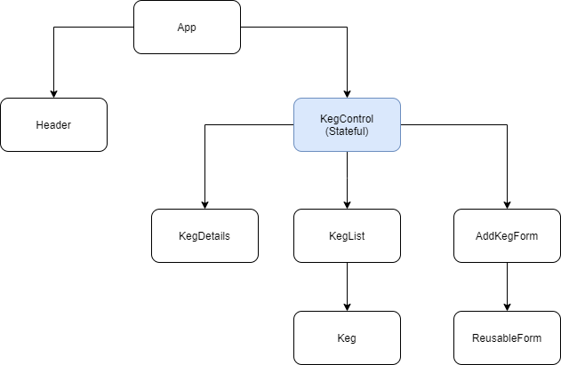

# TapRoom Keg Tracker

#### A React webpage which allows users to enter & manage information about kegs in a tap room, 2/19/21

#### By Eric Endsley

## Description
This is a webpage built with React for the 'React Fundamentals' independent project at Epicodus. The webpage allows users to enter information about a Keg for a taproom (name, brand, abv, price) and populate this information to keg cards in a list. These individual cards can be clicked to view detail pages which display the user inputted information as well as the number of pints remaining in the keg. On the details page the user can also click a button to signify that they have poured a pint, which will reduce the number of pints remaining by 1. giut

## Project Component Structure

## Setup
#### Get Node
This project requires Node.js to run. If you don't have Node installed on your machine already, navigate to the [Node download page](https://nodejs.org/en/download/) and follow their instructions to install.

#### Clone and Open The Code Locally
 1. Open the [Tap Room website](https://github.com/eric-endsley/tap-room.git) by clicking the link or copy/pasting https://github.com/eric-endsley/tap-roomt.git in the navigator bar of a web browser application.

 2. Click the green Code button in the upper-right part of the window and then EITHER:

 3. a. Copy the HTTPS URL for the repo and use it in the git clone command in git-bash or another git terminal by inputting: "git clone https://github.com/eric-endsley/tap-room.git" 
 OR b. Click "Download Zip" and unzip the file to an accessible location on your machine.

 4. Right click on the project directory and open it with VS Code or another code editor. 

#### Finish Setup Using Terminal and Open Webpage

 1. Run a terminal (e.g. GitBash) in the project directory and enter the terminal command "npm install" which will install all necessary components.

 2. Enter the commands "npm run build" followed by "npm run start" to initiate a live reloading instance of the webpage locally.

## Technologies Used
React, React-Bootstrap, Javascript, JSX, Node, HTML, CSS

## Known Bugs
None

## Contact Information
To ask questions or report a bug, contact [Eric Endsley](mailto:eric.endsley4@gmail.com)

## Legal
This software is licensed under the MIT license.
